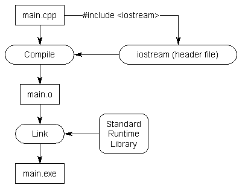
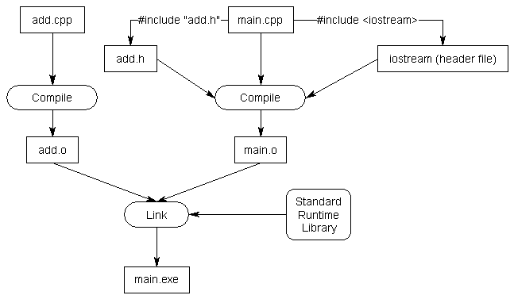

# 헤더 파일 (Header file)
 - 헤더 파일은 보통 .h 확장자를 가지며, 다른 파일에 대한 선언을 가지고 있다.

```cpp
#include <filename>
```

 - `<>` 는 컴파일러와 함께 제공되는 헤더 파일을 include할 때 사용한다.
 - C++ 런타임 라이브러리의 헤더 파일로써, 운영체제의 특별한 위치에 존재한다.



```cpp
#include "filename"
```

`""` 소스 파일이 있는 디렉토리에서 헤더 파일을 include 하도록 전처리기(preprocesser)에게 지시한다.<br>
일반적으로 자신이 작성한 헤더 파일을 include 한다.

## 헤더 파일 작성하기
 - 헤더 파일을 사용하면 선언을 필요한 만큼 한 번만 작성하면 되고, 함수 원형에 대한 유지보수를 편하게 해준다.
 
#### 헤더 파일은 두 부분으로 구성된다.
 1. 헤더 가드(header guard), 헤더 파일이 같은 파일에서 두 번 이상 포함(include)되지 않게 해준다.
 2. 두 번째 부분은 .h 파일의 실제 내용이다. 다른 파일에서 볼 수 있는 모든 함수에 대한 선언이다.

<br>
add.h

```cpp
// 헤더 가드의 시작
#ifndef ADD_H
#define ADD_H

int add(int x, int y);

// 헤더 가드의 끝
#endif
```
<br>
main.cpp

```cpp
#include <iostream>
#include "add.h"

int main()
{
    std::cout << "The sum of 3 and 4 is " << add(3, 4) << std::endl;
    return 0;
}
```

<br>
add.cpp

```cpp
int add(int x, int y)
{
    return x + y;
}
```

 - 컴파일러가 `#include "add.h"` 라인을 컴파일하면 add.h의 내용을 현재 파일의 그 라인 시점에 복사한다.<br>
   add.h에 add() 함수에 대한 함수 원형이 포함되어 있으므로 이 원형은 add() 함수의 전방 선언으로 사용된다.
 - 실제 정의는 링크 단계에서 구현 된다.

