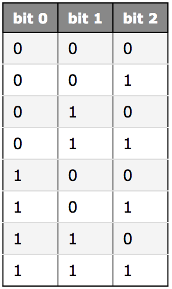
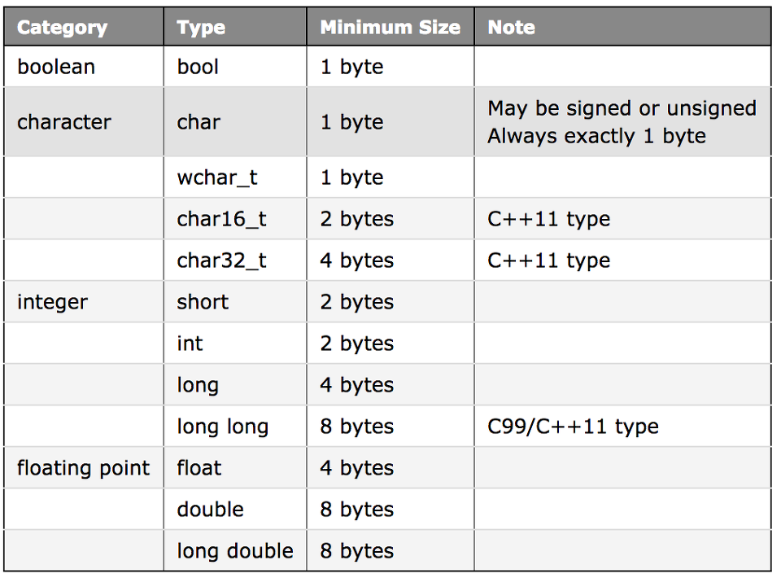

# 변수 크기와 sizeof 연산자

메모리는 일반적으로 바이트(byte) 크기 단위로 구성되며, 각 단위는 고유한 주소를 가진다. <br>
지금까지 메모리를 변수의 이름을 통해 정보를 넣고 가져올 수 있는 메일 박스처럼 생각했다.<br>

그러나 변수는 보통 1byte 이상 차지한다. 변수는 2, 4 또느 8 byte 이상 연속적인 메모리 주소를 사용할 수 있다.<br>
변수가 사용하는 메모리의 양은 자료형에 따라 다르다.

-----

### 첫째, 변수가 더 많은 메모리를 차지할수록 더 많은 정보를 저장할 수 있다.

일반적으로 n bit를 갖는 변수가 가질 수 있는 값의 경우의 수는 `2^n` 개다. 8bit의 경우 256(2^8)개가 된다.

3bit가 가질 수 있는 값의 경우의 수는 8개다.


-----

### 둘째, 컴퓨터가 사용 가능한 메모리양은 한정되어 있으므로, 자료형에 따른 변수 크기가 중요하다.

많은 양의 메모리가 필요한 프로그램의 경우, 1byte와 8byte 변수 사용에 차이가 난다.

-----

## C++ 기본 자료형의 크기

 - 자료형의 크기는 컴파일러 또는 컴퓨터 아키텍처에 의존한다.
 - C++은 기본 자료형이 최소 크기를 갖도록 보장한다.



-----

## sizeof

변수의 실제 크기는 컴퓨터에 따라 다를 수 있다.<br>
`sizeof` 연산자는 자료형 또는 변수를 가지고 크기를 byte 단위로 반환하는 연산자 이다.

```cpp
#include <iostream>

int main()
{   
    std::cout << "int : " << sizeof(int) << " bytes" << std::endl; // int is 4 bytes

    int x;
    std::cout << "x is : " << sizeof(x) << " bytes" << std::endl; // x is 4 bytes

    return 0;
}
```