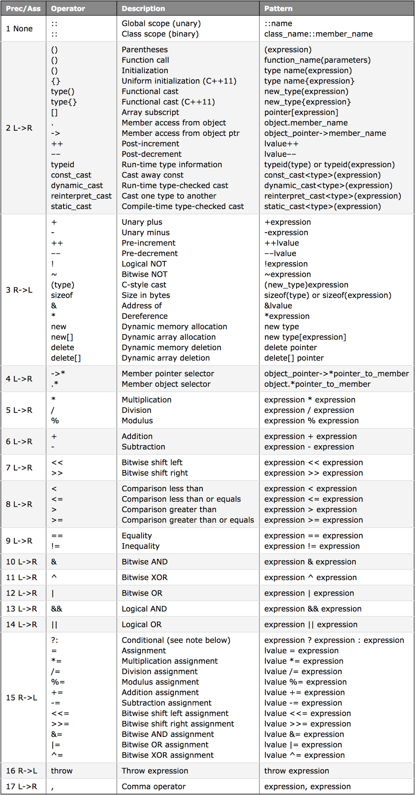

# 연산자 우선순위와 연관성

`4 + 2 * 3`과 같은 표현식(expression)을 이해하기 위해서는 연산자의 역할과 적용 순서를 모두 이해해야 한다.<br>
복합 표현식에서 연산자가 평가되는 순서를 **연산자 우선순위(operator precedence)** 라고 한다.

## 연산자(operator)
 - 우선순위(precedence) 레벨 1이 가장 높은 우선순위고, 레벨 17이 가장 낮은 우선순위다. 우선순위가 가장 높은 연산자가 먼저 평가된다.
 - L->R : 왼쪽에서 오른쪽으로의 연관성(associativity)을 의미한다.

 

 표현식의 평가 순서를 명확히 하려면 괄호 `()` 연산자를 사용하면 된다.

## 거듭제곱 연산은 어떻게 할까? (How do I do exponents?)

C++에서 거듭제곱 연산을 실행하려면 `<cmath>` 라이브러리의 `pow()`함수를 사용하면 된다.

```cpp
#include <cmath>

double x = std::pow(3.0, 4.0);
```

`pow()` 함수의 매개 변수 및 반환 값 모두 자료형이 `double`이다. 떄문에, 부동 소수점 숫자의 반올림 오류로 인해 결과가 정확하지 않을 수 있다.<br>

정수(integer) 기준으로 거듭제곱하려면 다음과 같이 함수를 작성하는 게 좋다.
```cpp
int pow(int base, int exp)
{
    int result = 1;
    while (exp)
    {
        if (exp & 1)
            result *= base;
        exp >>= 1;
        base *= base;
    }

    return result;
}
```